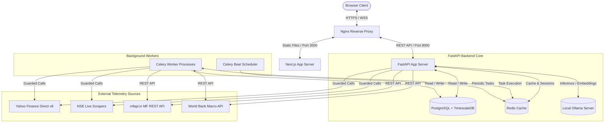
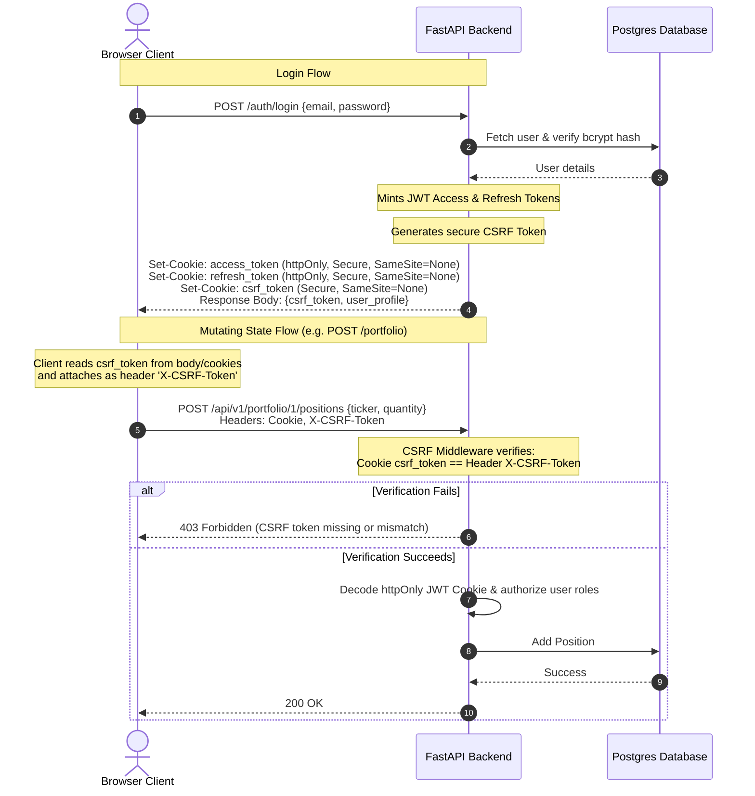
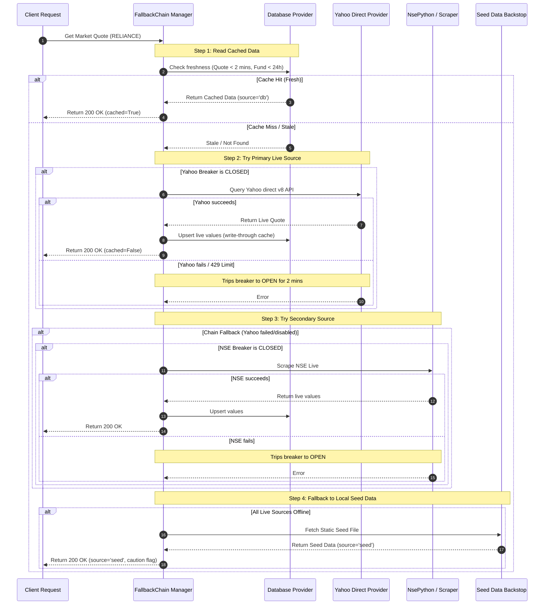
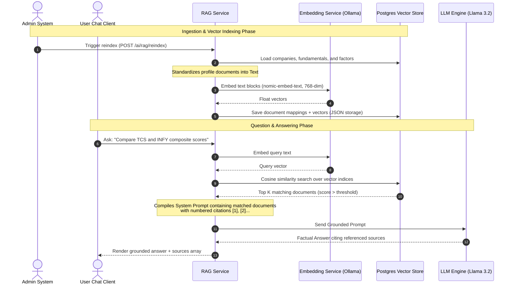

# QuantAI System Architecture Specification

This document details the software architecture, design patterns, security protocols, and database schema of the QuantAI Indian Market Analytics platform.

---

## 1. System Topology Overview

QuantAI is structured as a decoupled, multi-container full-stack application. It leverages self-hosted, open-source infrastructure to guarantee a 100% free operation without proprietary lock-in.



---

## 2. Security Architecture

QuantAI implements a zero-trust architecture at the application layer, utilizing a strict double-submit cookie protection model alongside secure token validation.

### 2.1 Double-Submit CSRF & httpOnly Authentication



### 2.2 Role-Based Access Control (RBAC)
User authorization is enforced via custom FastAPI dependencies (`require_role` and `require_admin`).
- **User Roles**: `user` (default) and `admin`.
- **Account Verification**: Checked via `is_verified` flag. Accounts must complete the email verification flow to access write operations.

---

## 3. High-Reliability Data Fallback Chain

To mitigate rate limiting and 403/429 blocking, QuantAI uses a resilient data pipeline featuring circuit breakers, token bucket rate limiters, and a sequential provider chain.



---

## 4. Grounded AI Chat RAG Pipeline

QuantAI features local AI grounding (Retrieval-Augmented Generation) using a local Ollama instance. This feeds structural company fundamentals, factor metrics, and market indices into the LLM context to deliver factual answers with source citations.



---

## 5. Database Schema Specification

QuantAI uses TimescaleDB (time-series hypertable engine) built on top of Postgres. 

### 5.1 Time-Series Hypertables
- **`price_ohlcv`**: Stores daily price points for equities. Partitioned by `time` (7-day intervals).
- **`mf_nav`**: Stores NAV history for mutual funds. Partitioned by `date` (14-day intervals).

### 5.2 Key Entity Schemas

```
companies
├── id (UUID, PK)
├── symbol (VARCHAR, Unique Index)
├── name (VARCHAR)
├── sector (VARCHAR)
├── industry (VARCHAR)
├── market_cap (NUMERIC)
└── created_at (TIMESTAMP)

price_ohlcv (Hypertable)
├── time (TIMESTAMPTZ, PK Column)
├── symbol (VARCHAR, PK Column, Index)
├── open (NUMERIC)
├── high (NUMERIC)
├── low (NUMERIC)
├── close (NUMERIC)
├── volume (BIGINT)
└── adj_close (NUMERIC)

fundamentals
├── id (UUID, PK)
├── symbol (VARCHAR, Unique Index)
├── pe_ratio (NUMERIC)
├── pb_ratio (NUMERIC)
├── eps (NUMERIC)
├── roe (NUMERIC)
├── roce (NUMERIC)
├── dividend_yield (NUMERIC)
├── debt_equity (NUMERIC)
└── fetched_at (TIMESTAMP)

factor_scores
├── id (UUID, PK)
├── symbol (VARCHAR, Unique Index)
├── momentum_score (NUMERIC)
├── quality_score (NUMERIC)
├── value_score (NUMERIC)
├── growth_score (NUMERIC)
├── composite_score (NUMERIC)
└── computed_at (TIMESTAMP)

mf_schemes
├── id (UUID, PK)
├── scheme_code (INTEGER, Unique Index)
├── scheme_name (VARCHAR)
├── amc (VARCHAR)
├── category (VARCHAR)
└── sub_category (VARCHAR)

mf_nav (Hypertable)
├── date (DATE, PK Column)
├── scheme_code (INTEGER, PK Column, Index)
└── nav (NUMERIC)
```

---

## 6. Celery Periodic Task Topology

Background data ingestion and scheduled tasks are run via the Celery Beat scheduler:

| Task Name | Interval / Cron | Source | DB Table |
|---|---|---|---|
| `warm_live_universe_task` | Every 30 min (9:15-15:30 IST) | Yahoo Direct | `market_quotes` |
| `daily_eod_bhavcopy_task` | Daily 16:30 IST | NSE Bhavcopy | `price_ohlcv` |
| `mf_nav_daily_sync_task` | Daily 22:30 IST | mfapi.in | `mf_nav` |
| `alerts_evaluation_task` | Every 1 min | Database Cache | `alerts` (evaluates price trigger rules) |
| `rag_delta_reindex_task` | Weekly Sunday 02:00 | Database Store | `embeddings` (recompute factors/vectors) |
